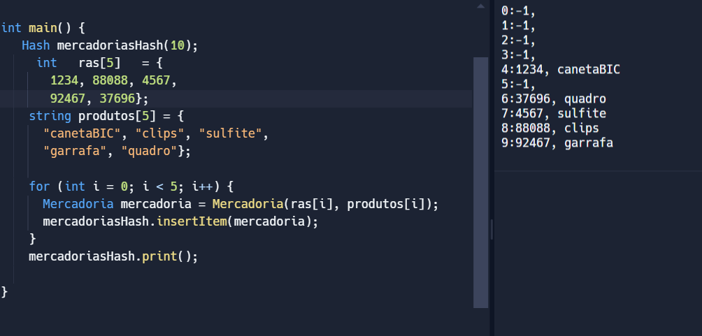
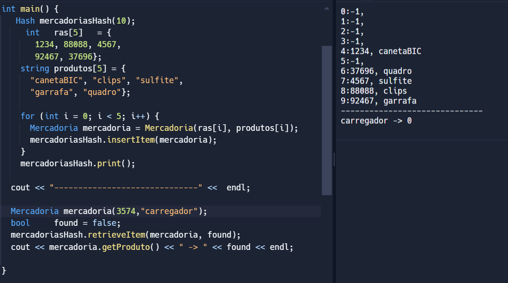
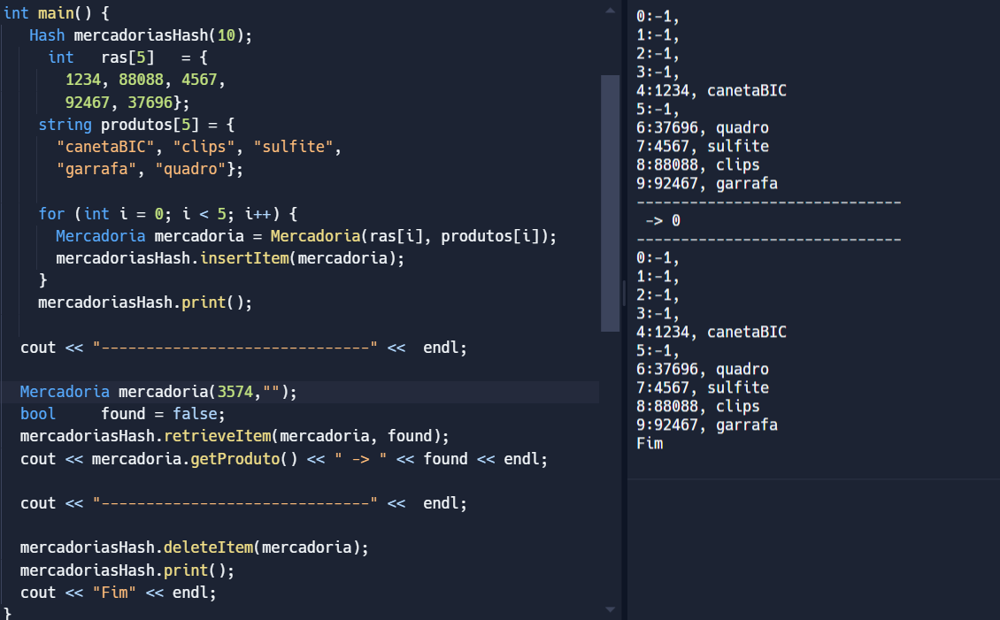

# HashTable - Atividade

## Casos de Teste 
#### Abaixo serão listado 5 Casos de Teste para a Tabela Hash desenvolvida.

 
Figura 01 - Tabela Original  
</img>
Fonte: Elaborado pela autora.

&emsp; A figura 01 se trata ta primeira versão da tabela hash de produtos, nela todos os itens listados possuem o último digito do "Id" diferentes, o que não resultou em nenhuma colisão.

 
Figura 02 - Tabela com colisão  
</img>
Fonte: Elaborado pela autora.

&emsp;A figura 02 representa o 1° caso de teste, no qual o "Id" do produto "garrafa" foi alterado, resultando em uma colisão com o produto "sulfite", porém como esse está posicionado anteriormente na lista de produtos, a garrafa foi realocada para a posição livre mais próxima, a "9".

 
Figura 03 - Tabela com Localização de Produto Existente  
</img>
Fonte: Elaborado pela autora.

&emsp; Na figura 03, caso de teste 2, foi insirido o "Id" da "garrafa" para localizá-la na tabela, logo o índice numérico (1) representa que um produto correspondente foi encontrado, sendo esse indicado como a garrafa.

 
Figura 04 - Tabela com Localização de Produto Inexistente por id  
</img>
Fonte: Elaborado pela autora.
 
Figura 05 - Tabela com Localização de Produto Inexistente com nome  
</img>
Fonte: Elaborado pela autora.

&emsp; Nas figuras 4 e 5, 3° caso de teste, há a tentativa de localizar um produto que não existe na tabela, primeiramente por "Id", e depois com o nome do produto. Como o esperado, o índice retornado é 0 (com e sem o nome do produto, dependendo da tentativa de localização), indicando que não há nenhum produto correspondente na tabela hash.

 
Figura 06 - Tabela com Remoção de Produto Existente  
</img>
Fonte: Elaborado pela autora.

&emsp; Para o caso de teste 4, a figura 6 ilustra a tabela hash deletando a garrafa, logo após a localização do produto existente nela, descrito no caso de teste 2.

 
Figura 07 - Tabela com Remoção de Produto Inexistente por id  
</img>
Fonte: Elaborado pela autora.
 
Figura 08 - Tabela com Remoção de Produto Inexistente com nome  
</img>
Fonte: Elaborado pela autora.

&emsp; Por fim, o caso de teste 5 é ilustrado por duas figuras, assim como o 3, que mostram a tentativa de deletar um produto inexistente na tabela, sendo primeiro apenas pelo seu "Id", e depois pelo nome do produto. Ambas as tentativas obtêm o mesmo resultado, o produto não é encontrado na tabela (uma vez que nunca existiu nela), logo não há nada a ser deletado, retornanto a mesma tabela do início.

_PS.: Não foi utilizado a técnica do númerro primo na elaboração da tabela hash nessa atividade._
_PS2.: Os códigos desenvolvidos foram baseados no autoestudo indicado._
