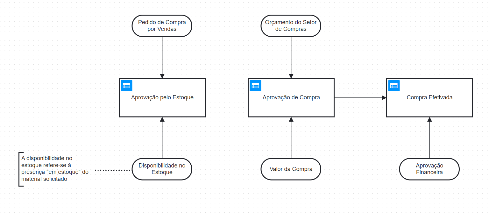

# Regras de Negócio e DMN

### As Regras de Negócio desenvolvidas para essa atividade foram:

1 - Uma compra só pode ser efetivada sem a necessidade de aprovação pelo setor financeiro se estiver dentro do orçamento previamente estabelecido para o setor de compras.  
2 - Toda compra que exceder o orçamento predefinido deve ser enviada para aprovação do setor financeiro. Somente após essa aprovação, a compra pode ser efetivada.  
3 - Se uma solicitação de compra for rejeitada pelo setor financeiro, o setor de Compras deve reavaliar as cotações com os fornecedores e tentar otimizar os custos ou buscar novas opções.  
4 - O setor de Compras deve realizar cotações com fornecedores e apresentar um comparativo detalhado antes de consultar o setor financeiro para aprovação final.  
5 - Sempre que um pedido de compra for solicitado pelo setor de Vendas, ele deve ser revisado e aprovado pelo setor de Estoque para verificar a disponibilidade dos itens.  

### E com base nelas, o seguinte DMN foi estruturado:

A imagem abaixo refere-se às regras de negócio 1, 2 e 5  

Arquivo `Ponderada-DMN.dmn` referente à [imagem acima](https://github.com/luizarsantana/Ponderadas/blob/c4903b863e35eeb5d9a42036c0a31e7f4ec5fee7/M%C3%B3dulo%20SAP/DMN/Ponderada-DMN.dmn) para vizualização das tabelas de decisão, inputs e outputs.
